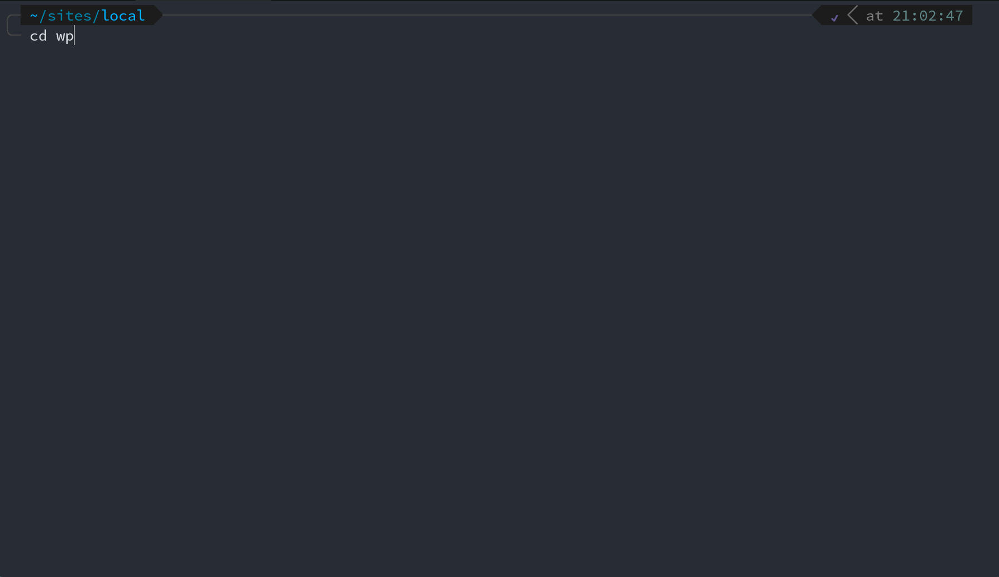
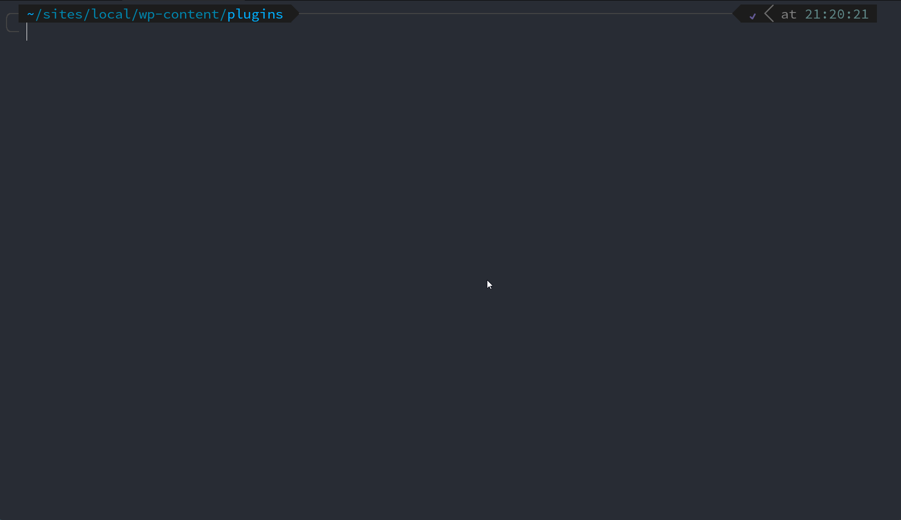

# slic

The slic (**S**tellarWP **L**ocal **I**interactive **C**ontainers) CLI command provides a containerized and consistent environment for running automated tests.

## Installation

1. Clone this repo
2. Follow the [Setup Instructions](docs/setup.md)
3. (Optional) Make [composer installs faster](docs/speedier-composer.md)

## Usage

The `slic` command has many subcommands. You can discover what those are by typing `slic` or `slic help`. If you want
more details on any of the subcommands, simply type: `slic [subcommand] help`.

### Telling `slic` Where to Look

The `slic` command needs a place to look for plugins, themes, and WordPress. By default, `slic` creates a `_plugins` and
`_wordpress` directory within the local checkout of `slic`. In most cases, developers like to run automated tests
against the paths where they are actively working on code–which likely lives elsewhere.

Good news! You can use the `slic here` sub-command to re-point `slic`'s paths so it looks in the places you wish. There
are two locations you can tell `slic` to look.

#### WordPress Directory

The first option is to navigate to the root of your site (likely where `wp-config.php` lives) and run the `slic here`
command.

```bash
# Change to your root directory of your site (where your wp-config.php file lives)
cd /path/to/your/site

slic here
```

By running `slic here` at the site level, this allows you to set plugins, themes, or the site itself as the location
from which to run tests. This also has the benefit of running tests within the WP version that your site uses.

##### Some Notes

Note: This is a somewhat opinionated option as there are some assumptions that are made:

1. That the WordPress directory _is_ the path you are indicating or in a sub-directory called `wp/`.
2. That the `wp-content/` (or `content/`) directory is a sub-directory of the location in which you are typing `slic here`.

#### Plugins Directory

If you want to defer all of the WP site configuration to a dynamically pulled codebase and _just_ worry about testing
plugins, you can run the `slic here` command right from the plugins directory. Doing so will restrict `slic` to running
tests on plugins _only_ and ignore themes and site-level tests.

```bash
# Change to your plugin containing dir (likely some path to wp-content/plugins)
cd /path/to/your/wp-content/plugins

slic here
```



### Initializing a Plugin

With your desired plugin containing directory set, you will need to initialize plugins so that they are prepped and ready
for `slic`-based automated test running. You do that using `slic init [plugin]`.

Example:

```bash
slic init event-tickets
```



What this command does:

1. The plugin is **cloned** if it does not already exist in the plugin directory.
2. Generates a `.env.testing.slic` env file in the plugin.
3. Generates a `test-config.slic.php` file in the plugin.
4. Generates a `codeception.slic.yml` file in the plugin.
5. Prompts for confirmation on running `composer` and `npm` installs on the plugin (and its common dir if present).

### Using a Plugin and Running Tests

Ok. You have `slic` set up. You've initialized your plugins. Now you want to run some tests. You need to tell `slic` which
plugin you wish to use and then you can run tests to your heart's content!

```bash
slic use event-tickets
slic run wpunit
```

#### `slic use [plugin]`

The `slic use [plugin]` sub-command sets which plugin codeception will point to for test running. If you don't pass a
target, the current working directory will be tried.

If you are unsure which plugins are available for use, you can execute `slic info`.

If you don't remember which plugin you are currently using, you can run `slic using`.

There are a few flavors of `slic use`:

* `slic use` – Attempts to set the current working directory as the current `slic` target (codeception, composer, npm, etc commands will run against that plugin).
* `slic use [plugin]` – Sets a specific plugin (regardless of the current working directory) as the current `slic` target.
* `slic use [plugin]/common` – Sets a plugin as the current `slic` target to the `common/` directory of the plugin.
* `slic using` – Tells you which plugin you are currently "using" (i.e. the last plugin on which you ran `slic use [plugin]`).

**NOTE: you cannot `slic use [plugin]` on multiple plugins at once. The `slic` command relies on its `.env.slic.run` file
to dictate which plugin it is pointing at.**

#### `slic run [testsuite]`

The `slic run [testsuite]` does precisely what you would expect. It runs the test suite against the plugin that is currently
being targeted by `slic use [plugin]`. This command is essentially a `codecept run` command, so you can pass all of the
typical Codeception arguments for `codecept run`.

### Killing Tests or Stopping `slic`

If you find yourself wanting to bring down the containers–whether to save on resources, bail out of tests, etc–you can
do so with the `slic down` sub-command. Running `slic-down` will shut down the containers regardless of what is being
run with them.

_Note: you may need to open a new shell window to run that command if another `slic` command is in progress._

### Other commands worth knowing

Honestly, all of them are worth knowing. But here are a few important ones worth remembering:

* `slic cli` – run WP CLI commands within the container stack.
* `slic composer` – run composer commands against the current plugin target.
* `slic composer-cache` – make composer faster by using your machine's compose cache directory.
* `slic debug` – activates/deactivates debug output.
* `slic info` – displays current `slic` environment settings.
* `slic npm` – run npm commands against the current plugin target.
* `slic shell` – drop into bash in the containerized environment.
* `slic target` – run the same command against multiple targets. 
* `slic xdebug [status|on|off]` – shows/sets xdebug status and info.
